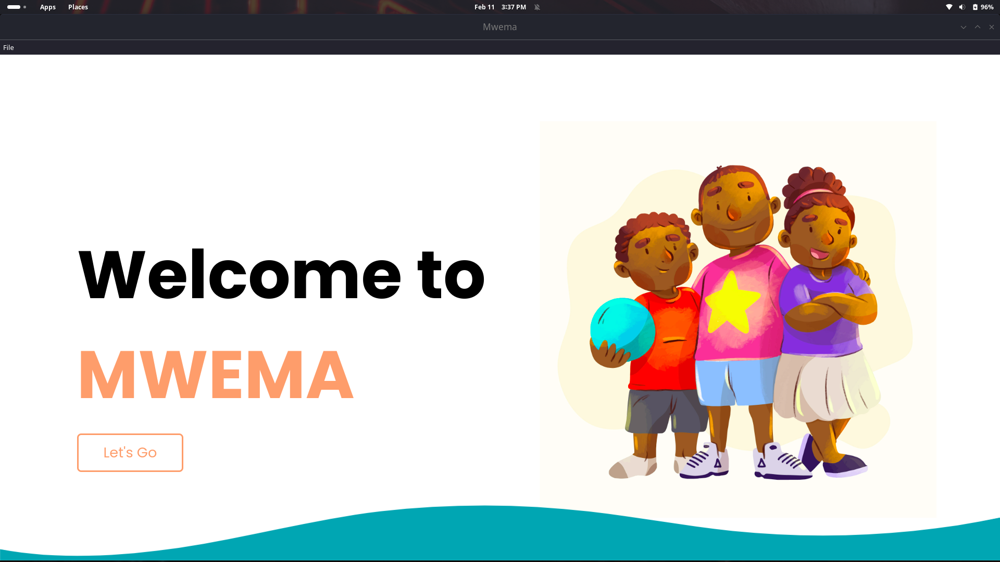
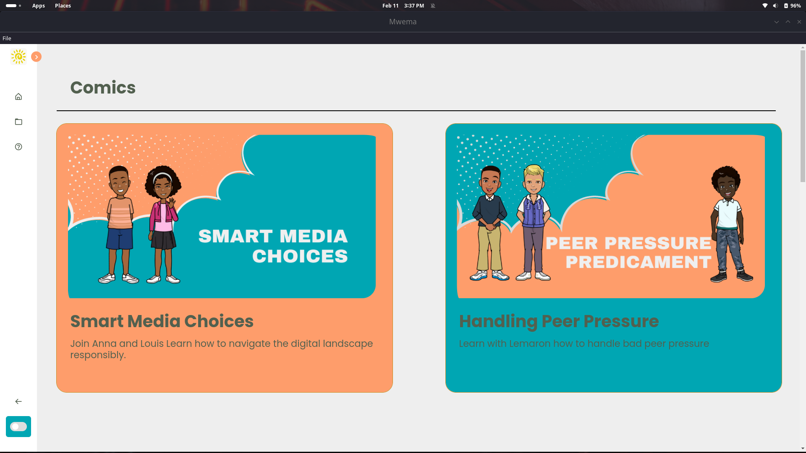
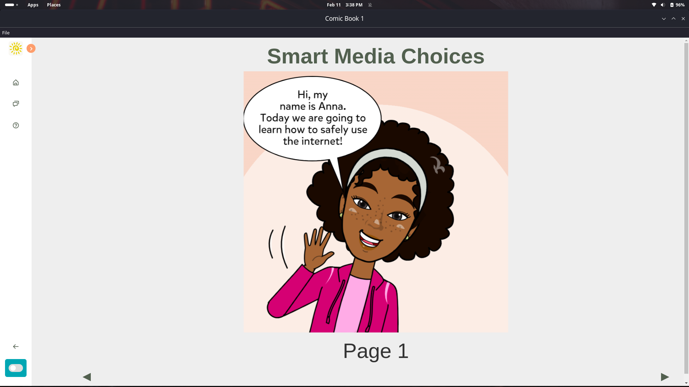
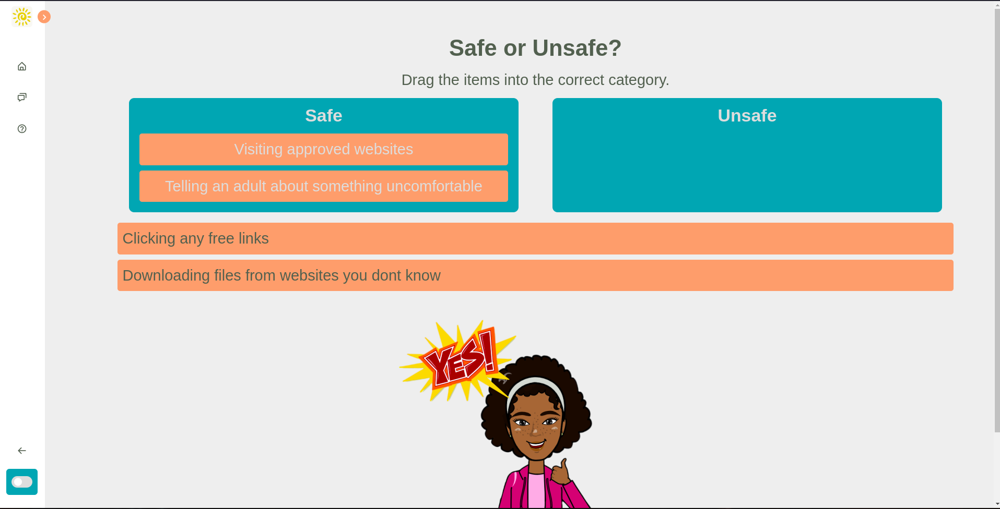

# Mwema - Kids Character Development App

Mwema is an engaging desktop application designed to help children build character and life skills through interactive exercises. The app allows kids to learn through comics and fun activities.

---

## Table of Contents

- [Screenshots](#screenshots)
- [Features](#features)
- [Technologies Used](#technologies-used)
- [Installation](#installation)
- [Usage](#usage)
- [Contributing](#contributing)
- [License](#license)
- [Contact](#contact)

---

## Screenshots

  
*Landing page when app opens.*

  
*Character development exercise in progress.*

  
*Comic book section of app.*

  
*Activity section of app.*

---

## Features

- **Interactive Learning:** Engages kids in various activities that promote character development.
- **Comics & Stories:** Fun comic book section to teach life lessons.
- **Activity Section:** Hands-on exercises to reinforce positive behavior.
- **Simple User Interface:** Easy-to-navigate interface suitable for kids.
- **Progress Tracking:** (Optional: Add if implemented) Track children's progress and achievements.

---

## Technologies Used

[](https://www.w3.org/html/)
[](https://www.w3.org/Style/CSS/)
[](https://www.javascript.com/)
[](https://www.electronjs.org/)

---

## Installation

### Prerequisites

- **Node.js** and **pnpm** must be installed. [Download Node.js](https://nodejs.org/) and [Install pnpm](https://pnpm.io/installation)

### Steps

1. **Clone or download** the repository to your local machine.
2. **Navigate** to the project folder using your terminal/command prompt:
   ```bash
   cd your-repository-folder
   ```

3. **Install** the required dependencies:
   ```bash
   pnpm install
   ```
4. **Run** the app:
   ```bash
   pnpm start
   ```
---
## Usage
1. **Launch** the app by running `pnpm start`.
2. **Navigate** through the different sections using the menu.
3. **Engage** in the activities and learn through the comics.
4. **Track** your progress and achievements.
---

# Contributing
Contributions are welcome! If you have suggestions or want to contribute, please fork the repository and submit a pull request.

Fork the repository.
Create your feature branch (`git checkout -b feature/YourFeature`).
Commit your changes (`git commit -am 'Add some feature`).
Push to the branch (`git push origin feature/YourFeature`).
Open a pull request. 

# License

This project is licensed under the MIT License - see the [LICENSE](LICENSE) file for details.

# Support

If you find this project helpful, please give it a ⭐️ on GitHub!
