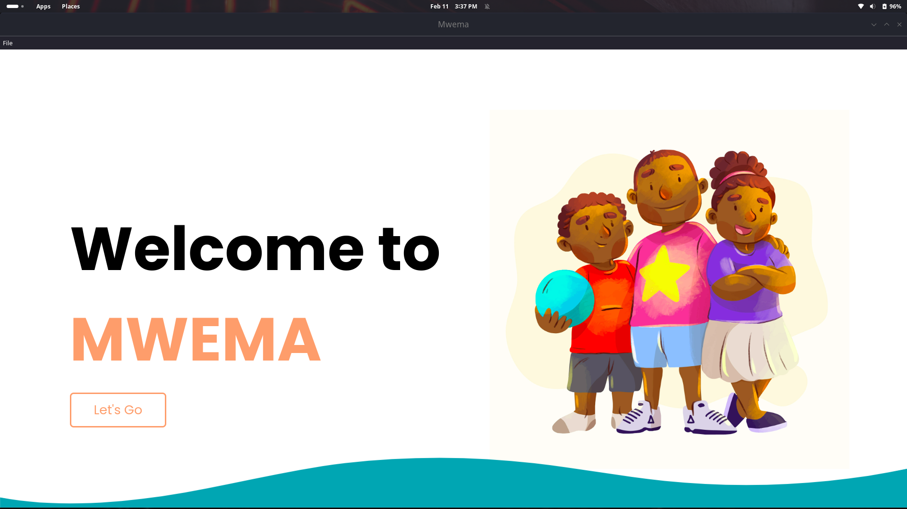
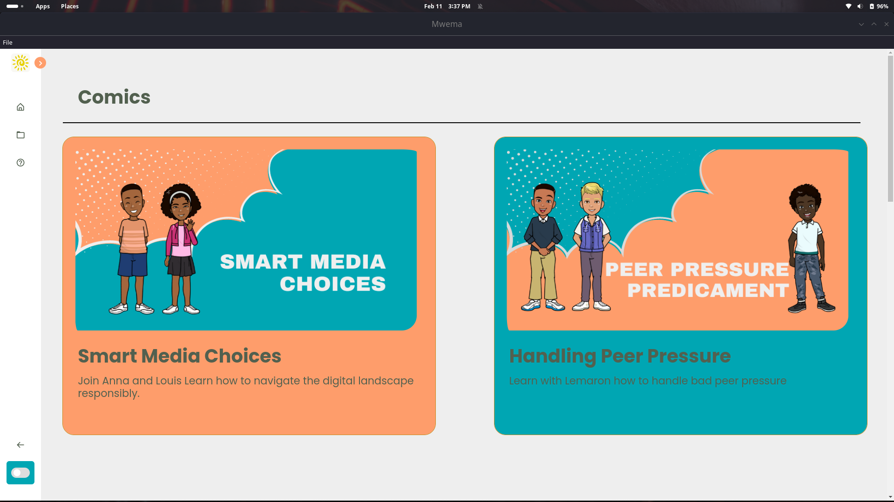
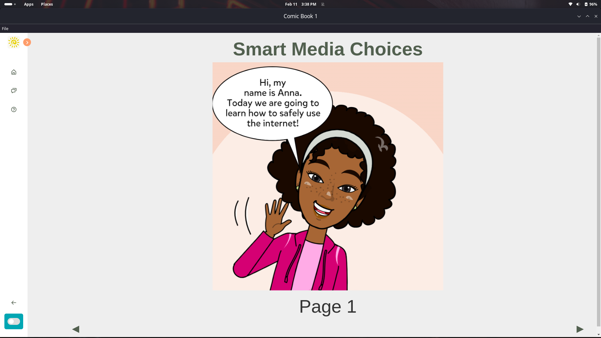
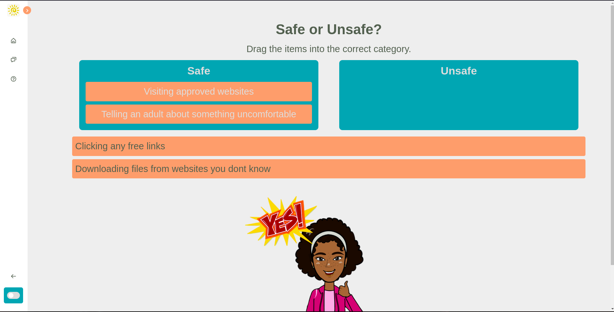

# Mwema - Kids Character Development App

Mwema is an engaging desktop application designed to help children build character and life skills through interactive exercises. The app allows parents or educators to track progress and ensure that kids are learning good values while having fun.

## Screenshots
  
*Landing page when app opens.*

  
*Character development exercise in progress.*

  
*Comic book section os app.*

  
*Activity Section of app*


## Technologies Used
[](https://www.w3.org/html/)[](https://www.w3.org/Style/CSS/)  [](https://www.javascript.com/)  [](https://www.electronjs.org/)  

## Features
- **Interactive Learning**: Engage kids in various activities that promote character development.
- **Simple User Interface**: Easy-to-navigate interface suitable for kids.

## Installation

### Prerequisites:
- Ensure **Node.js** and **npm** are installed on your system. If not, install them from [Node.js official website](https://nodejs.org/).

1. Clone or download the repository to your local machine.
2. Navigate to the project folder using your terminal/command prompt:
   ```bash
   cd your-repository-folder
